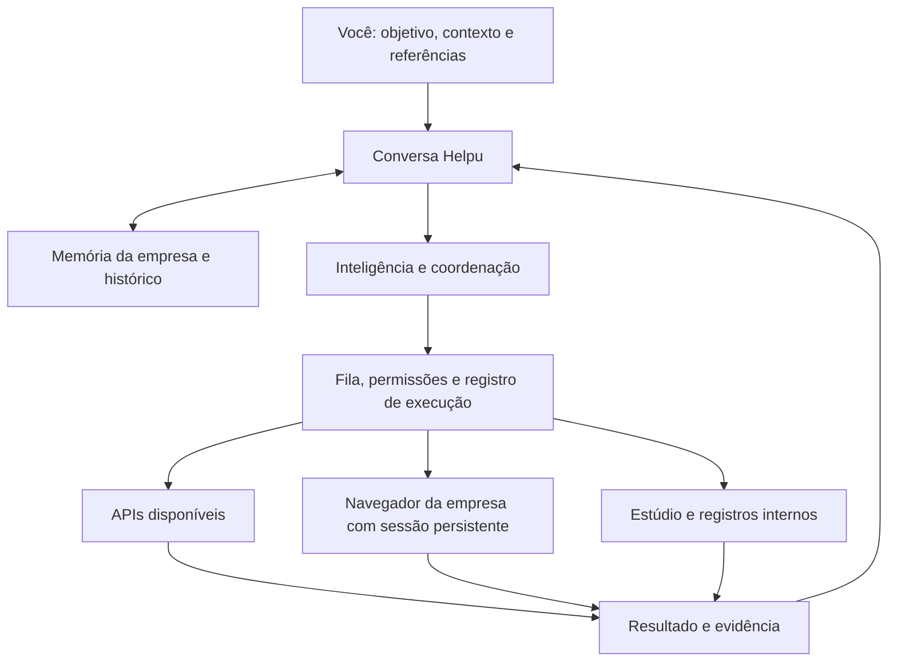

# Helpu — agência que conversa e executa

Proposta e implementação local · 11 de setembro de 2026

Atualização operacional: a consolidação posterior desta base está descrita em [HELPU-OPERATING-KERNEL.md](HELPU-OPERATING-KERNEL.md). Ordens persistentes, políticas por ação, aprovação da versão e verificação de publicação foram conectadas aos registros existentes. As limitações de contas reais e executor remoto continuam valendo; o quadro original abaixo descreve a base que foi reaproveitada.

A Helpu deve receber objetivos como uma agência: entender a empresa, propor uma direção, produzir entregas, distribuir, atender e acompanhar resultados. A conversa é a entrada principal. Campanhas, arquivos, contatos e indicadores são a memória operacional que essa conversa organiza.

## A experiência

A referência do TravelPro foi aplicada à organização da interface: página clara, bastante espaço, pergunta central, caixa ampla para pedidos e referências, sugestões de início e navegação inferior. A identidade aprovada da Helpu permanece.

Um pedido típico seria: “Prepare a campanha da EME para esta semana, use a nossa identidade e deixe os conteúdos no calendário.” A Helpu consulta o que sabe sobre a EME, identifica o que falta, prepara os materiais e registra o andamento. Um pedido de publicação ou atendimento precisa indicar esse objetivo; preparar uma campanha, por si só, não informa qual mensagem enviar a qual pessoa.

A conversa deve mostrar entregas e evidências: arquivo criado, registro salvo, execução pendente, resultado confirmado ou necessidade de intervenção. Abertura de uma janela, clique num botão e aceitação de uma API são etapas diferentes.

## A estrutura escolhida

Essa combinação evita precisar de uma integração específica para cada pequena função de cada site. As APIs continuam úteis para ações repetidas, dados estruturados e confirmações estáveis. O navegador cobre tarefas que estão disponíveis na interface da conta. A escolha deve considerar a capacidade real do canal, confiabilidade, custo e autorização para aquele pedido.

### Inteligência: existe API do Astra

Sim. A documentação atual disponibiliza `gpt-6-astra`, com uso de computador. O modelo recebe o objetivo e observações e propõe ações; a aplicação fornece e controla o ambiente onde elas acontecem. Contratar o modelo não conecta automaticamente o Instagram, o navegador ou a conta do Codex. [Modelo Astra](https://developers.openai.com/api/docs/models/gpt-6-astra), [uso de computador](https://developers.openai.com/api/docs/guides/tools-computer-use).

Nesta implementação, a conversa usa a Responses API, com `gpt-6-astra` como padrão configurável. O servidor oferece ferramentas delimitadas para consultar a empresa, salvar rascunhos, atualizar a marca, enfileirar ações e observar/operar o navegador. O agente recebe texto, elementos visíveis e uma imagem da página. Ele não recebe execução livre de comandos no computador.

São três acessos independentes: sua conta na Helpu, o provedor de inteligência e as contas de divulgação. A conexão com o provedor é central; não é necessário obter uma chave de API de cada rede para usar o caminho pelo navegador.

### Sessões já autenticadas

O caminho implementado é um **perfil dedicado por empresa e canal**, no Chrome ou Edge deste computador. Você abre “Contas conectadas”, escolhe o canal, faz login diretamente no site, confere a identidade e autoriza a operação. O navegador preserva o perfil no disco para reutilizar a sessão enquanto ela continuar válida. Essa persistência usa o mecanismo de perfis do Playwright. [Perfis persistentes](https://playwright.dev/docs/api/class-browsertype), [estado de autenticação](https://playwright.dev/docs/auth).

Isso não importa silenciosamente a sessão do seu Chrome pessoal. Se você já está conectado no navegador habitual, existe também um caminho oficial: versões compatíveis do Chrome permitem conectar o Chrome DevTools MCP à sessão existente, com depuração habilitada e aceite no navegador. **Esse segundo adaptador está previsto, mas não foi implementado nesta entrega.** [Conexão a uma sessão existente](https://developer.chrome.com/blog/chrome-devtools-mcp-debug-your-browser-session).

Login, código de duas etapas, CAPTCHA e recuperação de conta permanecem interações suas com o serviço. Uma sessão persistente pode expirar. O portal distingue “navegador aberto” de “conta confirmada por você”; a identificação da conta ainda não é uma verificação automática forte da plataforma.

### Alternativa de uso pessoal com Codex

Existe um caminho oficial para construir uma interface própria sobre o Codex: o **App Server**, com autenticação, conversas, eventos e aprovações. Ele oferece fluxos próprios de login, inclusive ChatGPT quando suportado pela conta. Pode ser avaliado para a sua instalação pessoal. O SDK atende outro formato de integração, voltado a tarefas programáticas. [App Server](https://learn.chatgpt.com/docs/app-server), [Codex SDK](https://learn.chatgpt.com/docs/codex-sdk).

Essa integração também não está implementada aqui. Não depende de extrair cookies ou copiar tokens internos do aplicativo. Para comercializar a Helpu, a arquitetura precisa definir acesso, custos e isolamento de cada cliente; não deve presumir que a assinatura pessoal do fundador é o serviço de inteligência de todos os clientes.

## O que já está no projeto

| Parte | Situação desta entrega |
| --- | --- |
| Entrada pela conversa | Implementada, com histórico por empresa, anexos, sugestões e modos Planejar/Executar |
| Contexto da marca | Dados da empresa, registros e arquivos usados nas ferramentas da conversa |
| Imagens e PDFs anexados | Enviados ao modelo no pedido atual; vídeos ficam como referências, sem análise de quadros |
| Operação pelo navegador | Gerenciador local e ferramentas implementados para Instagram, WhatsApp, Google e Higgsfield |
| Login e persistência | Perfil próprio por empresa/canal; login manual, confirmação e permissão de operação |
| Acompanhamento | Prévia da sessão, histórico de etapas e botão de pausa |
| Fluxos anteriores | Campanhas, estúdio, agenda, contatos, atendimento, captação, Google, agentes e indicadores preservados |
| Recuperação de falhas | Intenção persistida antes de interações; resultado ambíguo suspende a conta e bloqueia repetição integral |
| Pausa | Interrompe nos pontos de controle e cancela ações derivadas ainda pendentes; não desfaz ações já aplicadas |
| Testes | 43 verificações automatizadas aprovadas, com provedores e navegador controlados para os testes |

As ferramentas de navegador foram implementadas e testadas com um ambiente substituto. Esta entrega **não afirma que publicar, responder ou gerar mídia já foi validado nas suas contas reais**. A conversa precisa de uma conexão válida com a inteligência, e os canais precisam do seu login. O trabalho em sites reais depende também da interface, permissões e restrições de cada plataforma.

O mecanismo não consegue garantir que qualquer clique arbitrário corresponda a uma ação comercial permitida. Há restrições de domínio, ferramentas delimitadas, modos de operação e instruções ao agente, mas a primeira ativação deve ser acompanhada. A camada de autorização por ação específica, com verificação automática de identidade e evidências de cada canal, ainda precisa evoluir antes de autonomia comercial ampla.

## Como evoluir para um produto contínuo

Para a EME, a instalação local permite validar a experiência com menor complexidade: servidor e navegador ficam no mesmo computador. Eles precisam permanecer ligados. Publicar apenas os arquivos da página não mantém agentes ou sessões funcionando.

Para vender a Helpu, a proposta é separar um serviço central de um executor:

- **Serviço central:** contas, empresas, cobrança, memória, campanhas, filas e acompanhamento.
- **Executor pareado no computador:** mantém os logins e recebe tarefas por uma conexão autenticada iniciada por ele. É uma evolução a implementar; não há pareamento remoto nesta versão.
- **Executor na nuvem, opcional:** navegador persistente por cliente, ambiente isolado e janela interativa para login. Permite operação contínua, com custo de infraestrutura e tratamento de sessões próprio.

O navegador local atual fica indisponível quando a instalação usa uma origem pública configurada. Isso evita apresentar como pronto um controle remoto que ainda não existe. Uma versão hospedada precisa do executor pareado ou do ambiente de navegador em nuvem, sem expor portas de depuração na internet.

A sequência prática para ativar a EME é conectar a inteligência, completar os fatos da empresa, entrar numa conta de divulgação, testar uma leitura e preparar uma entrega. Depois, validar uma publicação definida por você e uma resposta a uma mensagem recebida. Esses casos fornecem evidências para ampliar as rotinas e os limites com confiança.

Os recursos que dependem de APIs continuam sujeitos às permissões do provedor. O navegador não elimina verificações, políticas de plataforma, restrições de automação ou exigências de autorização. Ele acrescenta uma forma de trabalhar na interface disponível da conta.
